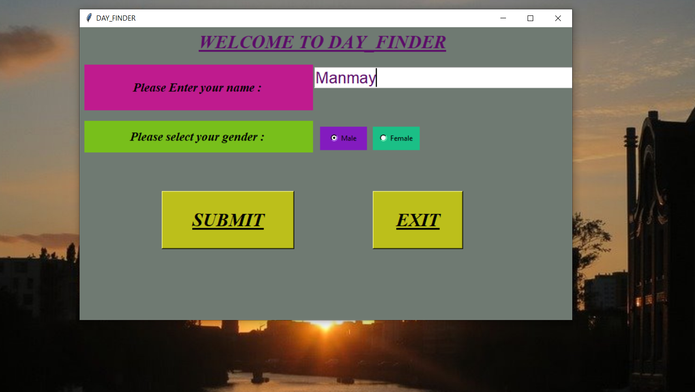
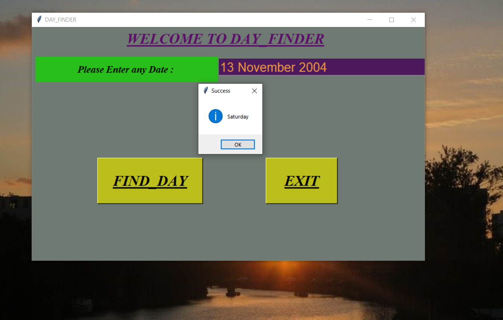

<!--  -->
<kbd></kbd>

# DAY_FINDER
THIS IS A SIMPLE PYTHON GUI APPLICATION WHICH HELPS YOU TO FIND THE PARTICULAR DAY OF THE RESPECTIVE DATE.

## Usage

- Open any editor like  VISUAL STUDIO CODE, run the above python code.
- After running the python code, You will be seeing a Graphics User Interface.

## Example

- After Entering Name,Gender : <!--  -->
            <kbd></kbd>
            
- Entering Date  (NOTE , YOU CAN ENTER DATE AS 13 NOVEMBER 2004 OR 13-11-2004 OR 13/11/2004) : <!--  -->
            <kbd></kbd>

           
**NOTE : HERE IN THIS GUI APPLICATION, A SPEAKING FEATURE IS TOO ADDED. HOPE YOU ENJOY USING THIS APPLICATION.**
 
 

 
 
## License

[MIT](https://choosealicense.com/licenses/mit/)

## Authors

- [@Manmay Chakraborty](https://www.github.com/manmay2)

## Feedback

If you have any feedback, feel free to reach out at manmaycoder@gmail.com

## Contributing

Contributions are always welcome!

Please feel free to contribute to this open source project.
If you spot a bug, or want to improve the code , or even make the dummy content better, you can do the following:
- Open an issue describing the bug or feature idea
- Fork the project/Repository, make changes, and submit a pull request 

Please adhere to this project's `code of conduct`.
